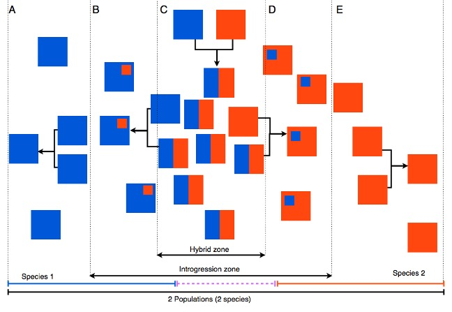
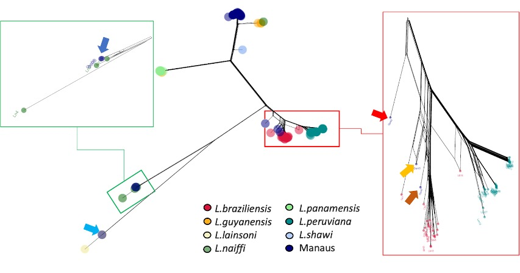
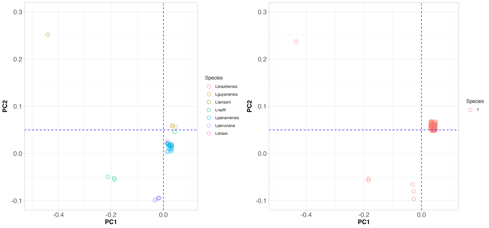
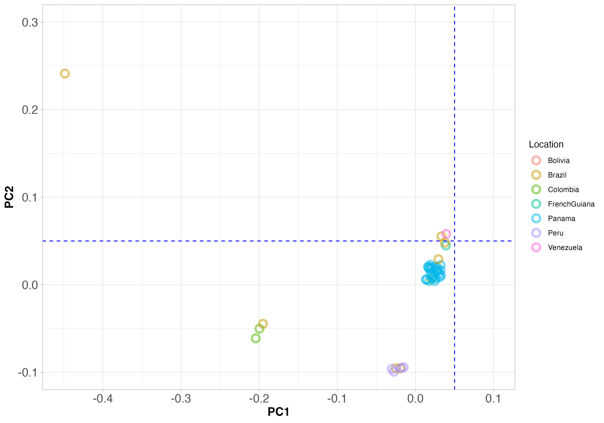
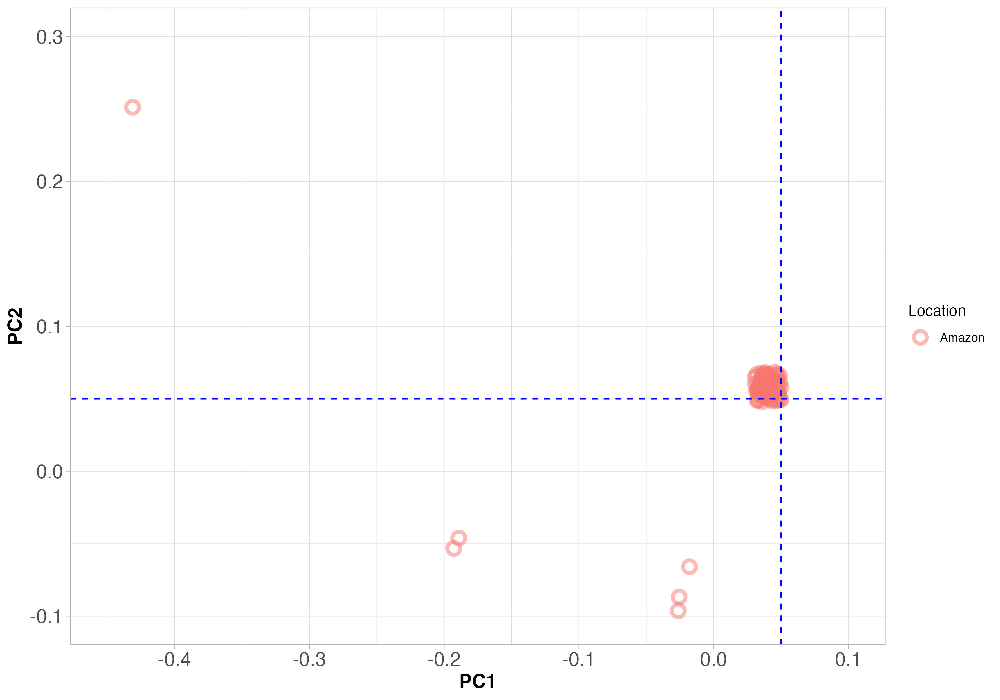
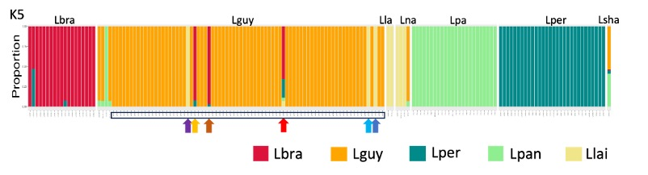
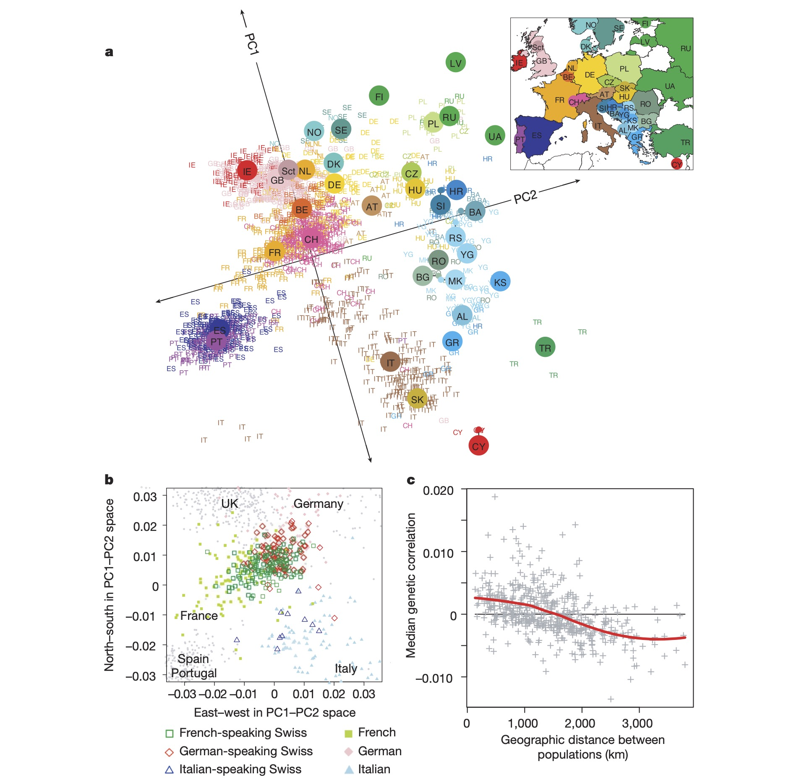

# Learning Objectives

- **SNP Data**: We show how single nucleotide polymorphism (SNP) data are stored in Variant Call Format (VCF). This kind of data is fundamental to modern population genomics. For example, we used the VCF file to generate the phylogenetic network, PCA, and STRUCTURE plots shown in this workshop.

- **Population Structure**: We show how to understand population structure using three different methods; a phylogenetic network, principal component analysis (PCA), and STRUCTURE/ADMIXTURE plots.

- **Species diversity and hybridization**: We show how to interpret the population structure of sympatric species, and how to identify hybrid individuals, various ways of analysing and displaying the SNP data; phylogenetic network, PCA, and STRUCTURE plots shown in this workshop.


---

# Introduction

## Evolution, populations and genome data

Earlier on in this module we introduced some concepts of populations:

- Virtually all species contain different **populations** of individuals
- Populations contain some genetic differences between them
- There can be **gene flow** between some populations
- Gene flow occurs when an individual from one population mates with an individual from another population

In practice, it can be hard to tell which population—or even which species—an individual belongs to, especially for micro-organisms. In this workshop, we’ll use genome data to examine populations, and species of *Leishmania* a single celled parasite.

In Figure 1 below, each box represents a *population* that contains many individuals. Red and blue boxes represent two species. Some regions have hybrids (mixed colours), and some do not. Some populations show a little mixing; others show a lot.


Figure 1: Imagined populations of two species (red and blue), with some hybrids and varying levels of mixing.


::: {.callout-note}

# In this workshop, we aim to improve our understanding of these topics

* **Populations and population structure:** Populations are very important, because all evolution occurs within a population

* **Population Genomics**: We show show whole-genome sequencing can reveal populations, and hybrids between populations and species.

* **Population analysis**: We see how populations can be visualised in different ways. Today, use principal component analysis (PCA), STRUCTURE plots, and a phylogenetic networks to look at the same data.

:::


# Case Study Context: Amazonian *Leishmania*

*Leishmania* parasites are diploid, single-celled protozoans that reproduce sexually via meiosis and cause Cutaneous Leishmaniasis (CL). In South America, species within the *Viannia* subgenus infect wild mammalian reservoir hosts and are transmitted by phlebotomine sand fly vectors. Because sand flies are weak fliers with narrow ecological niches, spatial gene flow ($m$) is limited, allowing stochastic genetic drift to drive differentiation between geographically separated populations.

We analyzed whole-genome short-read sequencing data from 152 isolates (or strains) of *Leishmania*. In this context, a *strain* is the same as an individual within a species. We look at  *Leishmania* strains from several different species. All these species are present in the Amazonian region of Brazil.

Today, we examine some population genomics results. These were generated from the genomes  *Leishmania* strains. As we explained in the lecture on **Population Genomics**, we used the genome data to identify single nucleotide polymorphisms (SNPs) across the genomes of these strains. We then used the SNP data to generate a phylogenetic network, PCA, and STRUCTURE plots.

# The data

The data we look at today come from 152 *Leishmania* strains. These strains are from several different species of *Leishmania*. The strains were collected from two sources:

* 71 *Leishmania* genomes that were collected from CL patients in Manaus, Brazil (we *think* these are *L. guyanensis*, but we'll see)
* 81 *Leishmania* genomes that we downloaded from the the [NCBI Sequence Read Archive (SRA)](https://www.ncbi.nlm.nih.gov/sra) for the following species: *L. braziliensis* ($n=21$), *L. panamensis* ($n=25$), *L. peruviana* ($n=34$), and *L. shawi* ($n=1$). 

::: {.callout-note}

# The [NCBI Sequence Read Archive (SRA)](https://www.ncbi.nlm.nih.gov/sra) contain genomes from many different species. 
SRA is a public repository for raw sequencing data. It is a great resource for population genomics studies, because it allows researchers to download and analyze data from many different species and populations.

::: 


# Exercises

## Data & Variant Call Format (VCF)

::: {.callout-note}
### Core concepts: Population Genomics & Population Structure

- Population genomic studies almost always use Single Nucleotide Polymorphisms (SNPs) as their input data. 

- This is because we find many SNPs in genomes, and they are relatively easy to analyze.This make SNPs ideal for discovering **population structure**, and analysing **genetic drift**, **allele frequencies** and  **natural selection**

- Population genomic studies very often start by analysing **population structure**

:::

SNP data are recorded in a standardized format, called Variant Call Format (VCF). Below is a sample VCF matrix containing diploid genotypes:

```bash
#CHROM	POS	REF	ALT	Lg1	Lg2	Lg3	Lg4
01	2177	A	G	0/1	1/1	1/1	0/1
01	2636	G	A	0/0	0/1	0/1	0/0
01	9844	G	A	0/1	0/0	0/0	0/0
...
35	9999	G	A	1/1	0/0	0/1	0/0
```

* **Coordinates**: `#CHROM` (chromosome ID), `POS` (bp position), `REF` (reference allele), `ALT` (alternate allele).
* **Genotype Calls**:
  * `0/0`: Homozygous reference allele.
  * `0/1`: Heterozygous carrier.
  * `1/1`: Homozygous alternate allele.

---

## Reticulate Evolution & Network Phylogenetics

::: {.callout-note}
### Core Module Concept: Topic 8 (Phylogenetic Analysis) & Topic 5 (Maintaining Variation)
Standard bifurcating phylogenetic trees assume purely vertical inheritance. When interspecific hybridization occurs, conflicting allele signals create reticulate evolution (network-like splitting), requiring split-network representations.
:::


*Figure 1: SplitsTree network of Viannia isolates. Dark blue dots represent Manaus clinical samples.*

::: {.callout-tip}
### Discussion Points: Network Phylogenetics

1. **Species Boundaries**: Do *Viannia* species form distinct monophyletic groups, or do they show interspecific overlapping?
   * **Answer**: Species form largely distinct clades, but central reticulations indicate historical gene flow and hybridization between lineages.
2. **Etiology in Manaus**: Most Manaus isolates cluster with *L. guyanensis*, but several map to separate species clades. What does this reveal about local disease ecology?
   * **Answer**: Cutaneous leishmaniasis in Manaus is sympatric and multi-species, driven by distinct parasite species occupying specific sand fly vector niches.
3. **Phylogenetic Artifacts (*L. shawi*)**: *L. shawi* (light blue) shows an unusually short branch length. Why do standard distance trees misplace hybrid genotypes?
   * **Answer**: Hybrid genomes inherit intermediate allele frequencies from parental species, causing cladogram algorithms to artificially pull the sample toward central internal nodes.
:::

---

## Population Structure & Dimensionality Reduction (PCA)

::: {.callout-note}
### Core Module Concept: Topic 6 (Population Structure) & Topic 1 (Stochastic Processes)
Principal Component Analysis (PCA) is a non-tree spatial method that reduces genome-wide SNP dimensions to summarize genetic distance, highlighting drift, subgroup differentiation, and continuous spatial variation.
:::

### Global vs. Local Species Differentiation



::: {.callout-tip}
### Discussion Points: Species Structure

1. **Sympatric Species Diversity**: Are all Manaus clinical isolates a single species?
   * **Answer**: No. Strains resolve into three distinct PCA clusters corresponding to *L. guyanensis*, *L. naiffi*, and *L. peruviana*.
2. **Genomic vs. Single-Locus Diagnostics**: Why is whole-genome PCA superior to single-gene PCR diagnostic assays?
   * **Answer**: Single-locus PCR can misclassify hybrids depending on which parental locus is amplified; whole-genome sequencing captures total genome-wide ancestry.
:::

### Spatial Differentiation & Isolation by Distance (IBD)

{width=400}
{width=400}
*Figure 3: Global Viannia PCA colored by country of origin (top) and Manaus clinical isolates on identical PC axes (bottom).*

::: {.callout-tip}
### Discussion Points: Isolation by Distance & Gene Flow

1. **Isolation by Distance (IBD)**: How does restricted sand fly movement create an Isolation by Distance pattern ($F_{ST}$ increasing with geographic separation)?
   * **Answer**: Restricted vector flight ranges restrict gene flow ($m$), allowing stochastic genetic drift to increase genetic differentiation ($F_{ST}$) over geographic distance.
2. **Signatures of Migration**: What does finding genetically identical isolates in geographically distant regions imply?
   * **Answer**: Recent long-distance migration, driven by the movement of infected human hosts or wild reservoir animal hosts.
3. **Reproductive Isolation**: If multiple *Leishmania* species co-occur sympatrically in Manaus, why do they remain distinct rather than blending via panmixia?
   * **Answer**: Specific vector-parasite interactions or pre-/post-zygotic reproductive barriers prevent unbounded interbreeding, preserving species identity.
:::

---

## Ancestry Proportions & Admixture Analysis

::: {.callout-note}
### Core Module Concept: Topic 6 (STRUCTURE Analysis) & Topic 5 (Maintaining Variation)
STRUCTURE/ADMIXTURE uses model-based Bayesian clustering to assign individual genomes to $K$ ancestral populations, quantifying admixture proportions and interspecific gene flow.
:::


*Figure 4: ADMIXTURE plot ($K=5$) across Viannia strains, with Manaus samples highlighted at the bottom.*

::: {.callout-tip}
### Discussion Points: Admixture Analysis

1. **Interspecific Admixture**: Does genome-wide admixture analysis show ongoing, widespread interbreeding across *Viannia* species?
   * **Answer**: No. Most individuals show single-color ancestral assignments, demonstrating strong reproductive barriers despite local sympatry.
2. **Hybrid Composition (*L. shawi*)**: What is the ancestry profile of *L. shawi*?
   * **Answer**: *L. shawi* displays ~50% *L. guyanensis* (orange) and ~50% *L. panamensis* (green) ancestry, confirming an admixed $F_1$-like hybrid origin.
:::

---

# Summary of Core Takeaways

* **Methodological Comparison**:
  * **Phylogenetic Networks**: Reveal reticulate evolution and non-treelike speciation events.
  * **PCA**: Summarizes population structure, continuous Isolation by Distance (IBD), and non-bifurcating relationships.
  * **STRUCTURE/ADMIXTURE**: Quantifies exact individual ancestry proportions ($K$) and identifies hybrid individuals.
* **Biological Insights**:
  * Cutaneous Leishmaniasis in Manaus is caused by multiple sympatric species.
  * Restricted sand fly dispersal drives spatial drift and IBD, while reproductive barriers maintain species integrity.

---

# Post-Workshop Practice Questions

## Question 1: Human Population Structure & Isolation by Distance


*Figure 5: Human genomic variation across European populations.*

::: {.callout-note collapse="true"}
### Sub-questions & Model Answers

a) **Is there evidence of complete panmixia across European populations?**
   * **Answer**: No. Individuals cluster by country of origin, reflecting structured non-random mating rather than panmixia.

b) **Compare allele frequency sharing between close vs. distant geographical populations.**
   * **Answer**: Neighboring populations (e.g., Spain and Portugal) share higher allele frequencies due to gene flow ($m$), whereas distant populations (e.g., Finland and Italy) exhibit higher differentiation ($F_{ST}$) due to isolation by distance and drift.

c) **How can spatial genomic PCA be applied to pathogen tracking and conservation genetics?**
   * **Answer**:
     * *(i) Pathogen tracking*: Tracing outbreak geographic origins and transmission pathways.
     * *(ii) Conservation*: Defining Evolutionary Significant Units (ESUs) to preserve adaptive genetic diversity and avoid extinction vortices.

d) **Which evolutionary process explains the correlation between genetic and geographic distance?**
   * **Answer**: Isolation by distance (IBD). High-mobility species exhibit flatter IBD slopes due to extensive gene flow, while low-mobility species exhibit steep IBD slopes due to localized drift.
:::

## Question 2: Population Genomic Methods & Workflows

::: {.callout-note collapse="true"}
### Sub-questions & Model Answers

a) **Outline the analytical pipeline from field sample to VCF file.**
   * **Answer**: Tissue collection $\rightarrow$ DNA extraction $\rightarrow$ High-throughput short-read sequencing (Illumina) $\rightarrow$ Read alignment to reference genome $\rightarrow$ Variant calling $\rightarrow$ Filtered VCF generation.

b) **Compare Phylogenetic Trees, PCA, and STRUCTURE plots.**
   * **Answer**:
     * *Phylogenetic Trees*: Model bifurcating vertical descent, but perform poorly with hybrids or reticulate signals.
     * *PCA*: Captures continuous variation and hybrids without prior assumptions, but lacks evolutionary time directionality.
     * *STRUCTURE*: Quantifies individual admixture proportions ($K$), but does not measure absolute genetic distance or evolutionary dates.
:::