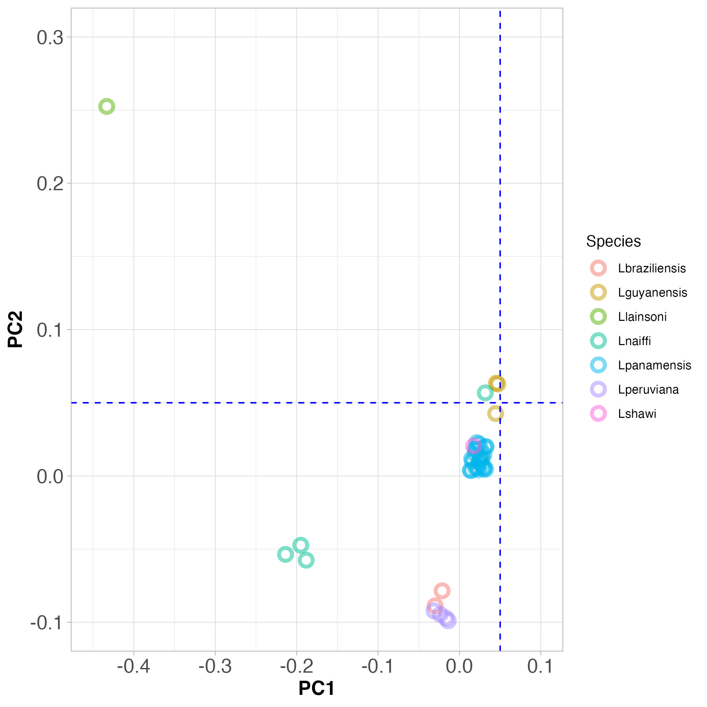
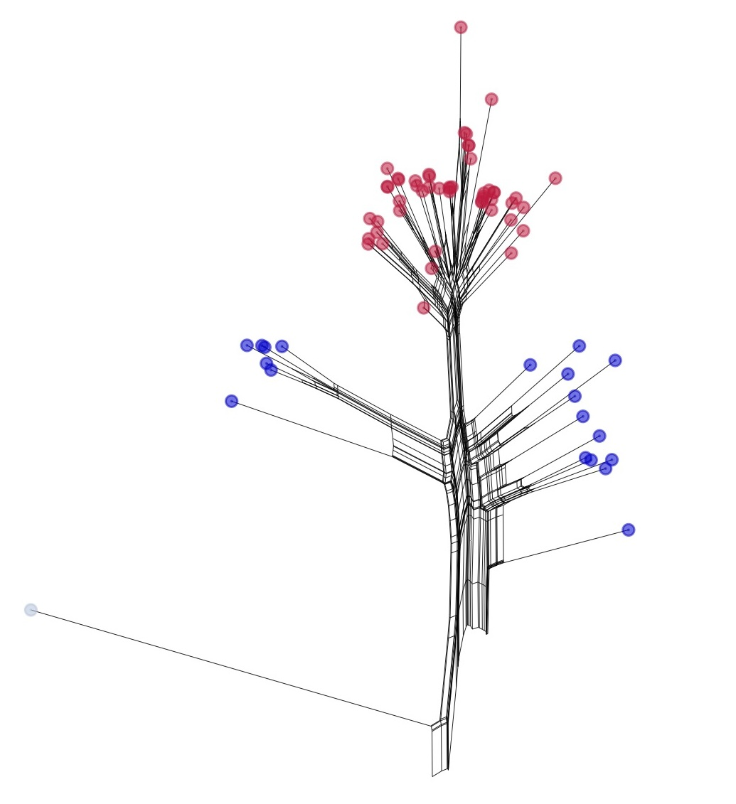
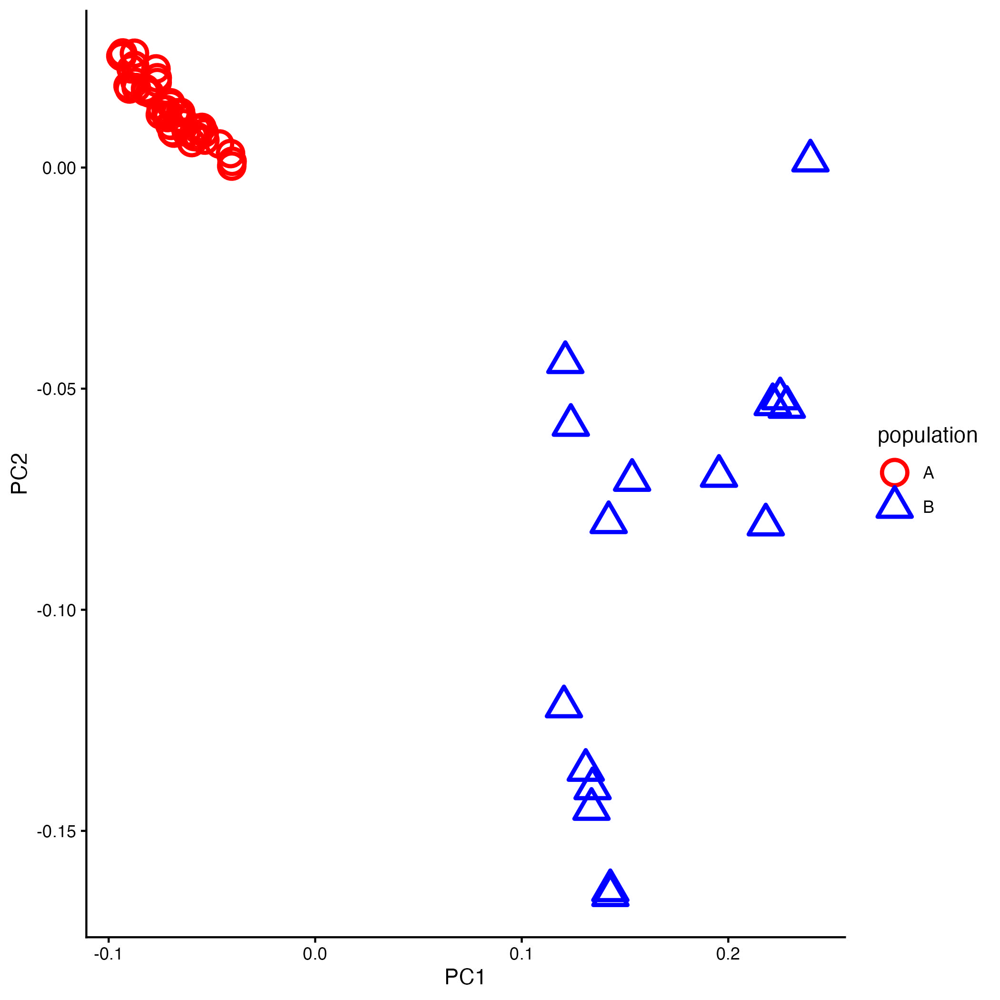

::: callout-important
# This document now contains answers to questions.
:::

# Learning objectives

The aims of this workshop are to:

- Consider how stochastic evolutionary processes like **random genetic drift** and **gene flow** affect populations and species
- Learn how to analyze and interpret population genomics data
- View a real-world example of population structure analysis

# Key Concepts examined in this Workshop

Before examining the dataset, keep in mind four primary concepts in population genomics:

- **Stochastic Evolutionary Processes:** Random **genetic drift** and **mutation** causes allele frequencies to fluctuate within and between populations, leading to populations differentiation over time
  - Genetic drift is the main process that leads to **population structure:** 
- **Gene Flow:** (e.g., via hybridization) can reduce differentiation between populations or species
- There are many ways to visualise **population structures:** 
  - structure/admixture plots
  - principal components analysis (PCA)
  - phylogenetic trees and networks
- **Phylogenetic Analysis:** Phylogenetic trees reconstruct evolutionary relationships (but do not show gene flow). They are useful for identifying populations and species, but can be misleading when hybridisation occurs.
- **Phylogenetic Networks:** Phylogenetic networks can show us **gene flow** between populations or species
- **Real-World Applications of population genetics/genomics:** population genomics is useful. Here we show how population genomics enables us to study infectious disease dynamics

# Introduction

## Evolution, populations and genome data

You will be aware now from earlier on in this module that: 

- Most species contain multiple populations
- Genetically, a population is a group of individuals more closely related to each other than to other groups, reflecting shared ancestry
- Sometimes hybrids occur between these closely related species

In practice, when studying microorganisms, it can be hard to tell which population (even which species) an individual belongs to. This can be the case with multicellular species too. In this workshop, we will show how population genomics can help us to identify populations and species.

{#fig-arch}

## The topic for today

This workshop explores the population genomics of *Leishmania*, a diploid, sexually reproducing protozoan parasite. We focus on the Viannia species complex in South America—closely related species (including *L. guyanensis*) that can interbreed where their ranges overlap.

Our analysis focuses strictly on parasite genetic relationships. We will analyze single-nucleotide polymorphisms (SNPs) from parasites collected in Manaus, Brazil, combined with public data from the [European Nucleotide Archive](https://www.ebi.ac.uk/ena/browser/) to study species structure and hybridization.

# Exercises

## The phylogeny

A phylogenetic tree is a good first look at how similar or different many samples are. But when individuals mix between populations or species (hybridisation), a simple branching tree can be misleading.

Think of a tree of people grouped by ancestry. Where would you place someone with one parent from Spain and one from Fiji? They don’t fit neatly on a single branch with the Spanish and the Fijians. The same display issue can happen in nature when populations interbreed.

To handle this, we used **phylogenetic network** approach. We use the software [**SplitsTree**](https://en.wikipedia.org/wiki/SplitsTree) to generate a network. This can show conflicting signals in the data, including evidence of hybridisation between species. A standard phylogenetic tree will **not** show us this.

Below is our SplitsTree network. There are many samples, so coloured dots cluster tightly. The Manaus samples are dark blue. Most cluster near *Leishmania guyanensis* at the top. We marked the Manaus samples that do not with arrows.

### Interpreting the phylogeny
Now spend some time discussing the SplitsTree phylogeny, using the discussion points below as a guide.

::: callout-tip

# Discussion points: phylogeny

- What do the **lengths** of the branches in the tree represent?
- **Answer:**  Genetic distance between samples. Longer branches indicate more genetic differences.

- Look at the large tree in the center. Each species is represented by a different coloured dot. Do the species look clearly separated?
- **Answer:** Yes, the species are mostly separate.

- Now look at the inset on the right (in the red box), which shows the detail in the network. Here each individual samples is represented by a different coloured dot. Can you see populations in this network? Can you see an individual that is a hybrid between species?

- **Answer:** Yes. One individual is sits between *L. braziliensis* and *L. peruviana*, and is likely a hybrid between these two species.

- Is there any evidence that there might be gene flow between *Leishmania* species in this data?
- **Answer:** Yes, we see hybrids between species in the network, which indicates gene flow across species boundaries.

- What is the main evolutionary process that has caused the differentiation between species in this network?
- **Answer:** Genetic drift, a stochastic evolutionary process that causes populations to diverge genetically over time.

:::

----



## Principal components clustering

Population structure reflects how genetic diversity is organized, offering key insights into speciation and natural selection. It is so important to population genetics/genomics that there are many ways to visualize it. One of the most common is **Principal Components Analysis (PCA)**.

Principal Components Analysis (PCA) simplifies thousands of SNPs into a 2D plot where spatial distance represents genetic distance: samples close together are genetically similar, while distant points are genetically distinct. Individuals from the same species or population typically cluster together.

Look at Figure 3, and discuss the PCA plot with the people at your table, using the discussion points below as a guide.

- Do the species cluster genetically?
- Do *L. peruviana* and  *L. braziliensis* really look like two different species?

Note: The blue dashed lines are a guide to the eye to help you see the clusters.

Now look at Figure 4, which shows PCA clustering of Viannia species from throughout South America (on the left), and those that were collected from Manaus (on the right). Note that the PC axes are on the same scale here.

### Interpreting principal component plots

Use the discussion points below to discuss the PCA plots with the people at your table.

::: callout-tip

# Discussion points: PCA (species)

- Does it look like the samples that came from Manaus are all the same species?
- **Answer:**  No certainly not. Some are in the same position as *L. guyanensis*, but others are from different species.

- Since the positions on the PCA plot separate the species, does this help to identify the species from Manaus?
- **Answer:** Yes, some are *L. guyanensis*, some are *L. naiffi* and others *L. peruviana*.

- What processes contribute to the differences between two *Leishmania guyanensis* populations?
- **Answer:** Mutation and genetic drift.

- What process might reduce the differences between two *Leishmania guyanensis* populations?
- **Answer:** Gene flow.

- What does this tell you about the causes of cutaneous leishmaniasis in the Amazon region?
- **Answer:** Since all these samples were **collected** from cutaneous leishmaniasis patients, this disease is caused by at least three different *Leishmania species*.

- Since *Leishmania* are single-celled organisms and they all cause a similar disease, population genomics is the only way to identify which sample belongs to which species. Why would we not merely use PCR to identify the species?

- **Answer:** Because we do see hybrids. If we used PCR, we might misidentify hybrids as one species or the other, depending on which gene we amplified. Population genomics allows us to see the whole genome, so we can identify hybrids.

:::



## Admixture/STRUCTURE plots

Yet *another* way of showing population genomic data is with so-called STRUCTURE plots, generated using software called STRUCTURE, or a similar tool called [ADMIXTURE](https://doi.org/10.1101/gr.094052.109), which is what we used. We’ll call these STRUCTURE plots for now.

STRUCTURE plots show the proportion of ancestry from different populations (or species) for each individual in the data set. Usually, each column of a STRUCTURE plot represents one individual, and the different colours within each column represent the proportion of ancestry from different populations (or species). 

The STRUCTURE algorithm uses genotype data to estimate individual ancestry proportions across a user-defined number of genetic clusters (usually called $K$ clusters). It allows us to visualise in a very intuitive way when some individuals contain genetic material from multiple populations or species (ie: hybrids).

Our STRUCTURE plot is below. Samples from Manaus are marked in the open rectangle at the bottom of the plot. Again, most look like *L. guyanensis*, and those that do not are marked with arrows, as we did in the phylogeny.

**Figure 7. A STRUCTURE plot showing the *Leishmania* species we studied.** Samples that were obtained from Manaus are marked in the open rectangle at the bottom of the plot. Most appear to be *Leishmania guyanensis*, but a few do not, and these are marked with arrows as we did in Figure 2, the SplitsTree phylogeny.

::: callout-tip

# Discussion points: The STRUCTURE plot

The most obvious thing about this plot is that the species are different colours. Each column is a different strain, and the colours represent the proportion of this strain’s ancestry that is derived from each species. If there are hybrids between species, we would expect to see columns with multiple colours.

- Does this visualisation of the data suggest that there is **extensive** breeding between species in the Viannia group? If so, this might result in **gene flow** between species. If not, this would suggest that the species are mostly reproductively isolated from each other.

- **Answer:** Yes, we can see some hybrids, consistent with interbreeding between species.

- Consider the *Leishmania* parasites circulating around Manaus (see Figure 4). Do they all look like one species, or are there multiple species present?
- **Answer:** No, there are multiple species present, consistent with what we saw in the phylogeny and PCA plots.

:::

## Populations of Leishmania guyanensis

In each species, there are probably multiple populations. In the case of *Leishmania guyanensis*, found two populations. We show the evidence for this in two ways. In Figure 6, we show a SplitsTree network phylogeny, and in Figure 7 we show a PCA plot.

::: {layout-ncol=2 layout-valign="center"}

:::

::: callout-tip

# Discussion points:  *L. guyenensis* populations

Examine the phylogeny in Figure 6A. Can you see the long branch that separates the red and blue samples? 

- What does the length of the branch tell us about the genetic distance between the red and blue samples?
- **Answer:** The length of the branch indicates the genetic distance.

Examine the PCA plot in Figure 6B.

- What do you notice about the positions of the red and blue points? Is is consistent with the phylogeny?
- **Answer:** Yes, the red and blue points are separated in the PCA plot, consistent with the phylogeny.

- What process or processes might have caused the differentiation between the two populations of *L. guyanensis*?
- **Answer:** Genetic drift.

- The ancestral (older) blue population is found in the Amazon rainforest. The newer (younger) red population is found in disturbed habitats, such as farmed  areas. Since the red population is found in a new habitat, what other process might be occurring in this population?

- **Answer:** Natural selection might be occurring in the red population, as it adapts to the new habitat.

:::

# Summary: what we have learned

- **Populations and Species Structure:** Natural **species** consist of one or more distinct **populations** characterized by shared genetic ancestry. Population genomic tools (phylogenies, PCA, STRUCTURE plots) allow us to identify these groupings even in morphologically similar microorganisms.

- **Genetic Drift:** Stochastic evolutionary processes like **genetic drift** cause geographically or reproductively isolated **populations** and **species** to diverge genetically over time, forming distinct clusters in genomic analyses.

- **Gene Flow:** Interbreeding between groups causes **gene flow**, which counteracts **genetic drift** by sharing alleles, reducing differentiation between **populations** or closely related **species** (visible as intermediate network branches or multi-colored columns in STRUCTURE plots).

- **Real-World Applications:** In *Leishmania*, population genomics reveals that multiple distinct **species** co-exist in Manaus causing identical cutaneous leishmaniasis symptoms, with rare interspecific **gene flow** and distinct internal **populations**.

::: callout-note
# More about principle component analysis (PCA)

You **don’t** need a detailed understanding of PCA for this module. But an understanding of PCA may help you in the future. Here are some videos that explain principle component analysis (PCA).

- [A nice simple explanation](https://youtu.be/kw9R0nD69OU?si=PRNygDRyM_pBQ6NE) (4 minutes)
- [A very intuitive explanation](https://youtu.be/TJdH6rPA-TI?si=uLV-5oYw-1vau-S3) (20 minutes)
- [A mathematical explanation for those who like maths](https://youtu.be/FgakZw6K1QQ?si=yUTobGFdy18sGEj9) (20 minutes)

:::

# After the workshop: exam-style questions

## Question 1. Population Structure, Genetic Drift, and Gene Flow

A PCA plot of human populations from Europe is shown in Figure 8 below. Each point is an individual, colored by **country** of origin.

Here we concern ourselves only with these countries; ES: Spain and PT: Portugal, IE: Ireland, GB: Great Britain / United Kingdom, 
NL: Netherlands, BE: Belgium, FR: France, DE: Germany and IT: Italy. Note that Spain (ES) is partially obscured by Portugal (PT) in the PCA plot.

- **a)** Explain what the PCA plot in part (a) tells us about the genetic relationships between these European populations. Who is closely related to people from Ireland (IE)? Who is closely related to people from France (FR)?

- **b)** Note that Spain and Portugal show overlapping points on the PCA plot. What does this tell us about the history of **gene flow** between these two countries?

- **c)** What can you infer about the relatedness of people from northwest Europe (Ireland, GB: Great Britain, NL: Netherlands, BE: Belgium and FR: France) compared to the countries on th Iberian peninsula (ES: Spain, PT: Portugal)?

- **d)** What can you infer about the genetic history of the people who speak different languages in Switzerland (CH) from part (b) of the figure?

## Question 2. Processes underlying population structure

- **a)** As populations diverge genetically, they become more distinct from each other. What is the main evolutionary process that causes this divergence?

- **b)** What are two population processes that keep populations more closely related?

- **c)** Part (c) of the figure shows the relationship between genetic distance and geographic distance. Explain this relationship and what it tells us about the movement of people and genes across space.

### Model answers

1a) 
Closely related to people from Ireland (IE): GB/Scotland
Closely related to people from France (FR): Switzerland (CH) or Belgium (BE)

1b) 
History of gene flow between Spain and Portugal: The overlapping points suggest that there has been significant gene flow between Spain and Portugal, likely due to historical migrations, trade, or other forms of contact.

1c) 
Relatedness of people from northwest compared to the countries on th Iberian peninsula:  The people from northwest Europe (Ireland, Great Britain, Netherlands, Belgium, and France) are more genetically similar to each other than they are to the people from the Iberian Peninsula (Spain and Portugal). This is likely due to shared historical migrations and gene flow between the northwest European populations.

1d) 
People who speak French have French ancestry, people who speak German have German ancestry, and people who speak Italian have Italian ancestry. The PCA plot shows that the genetic structure of Switzerland reflects its linguistic diversity, with individuals clustering according to their language group, indicating limited gene flow between these groups historically.

2a) Genetic drift

2b) Migration and interbreeding (gene flow).

2c) The relationship between genetic distance and geographic distance indicates that as the geographic distance between populations increases, the genetic distance also tends to increase. This is because populations that are geographically closer are more likely to interbreed and share genes, while populations that are farther apart have less opportunity for gene flow, leading to greater genetic differentiation over time.

